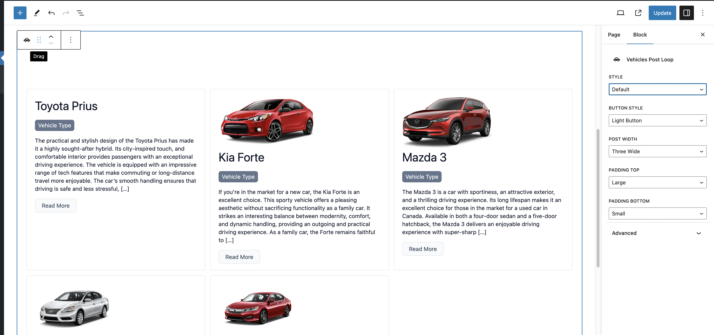
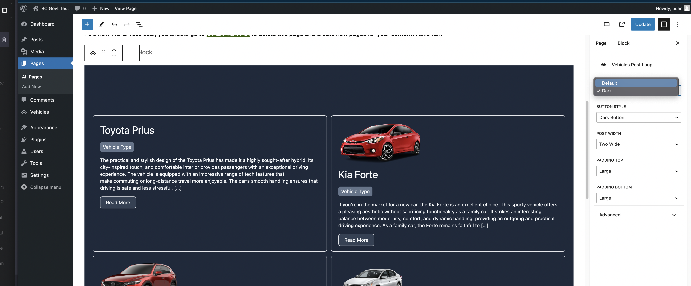
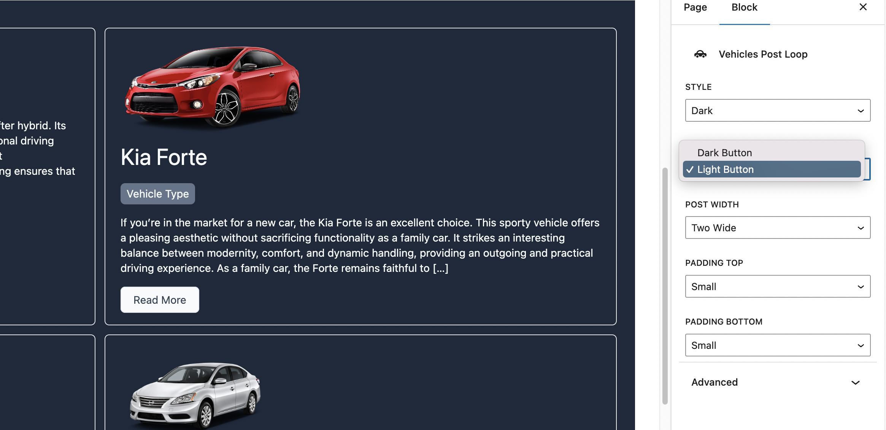
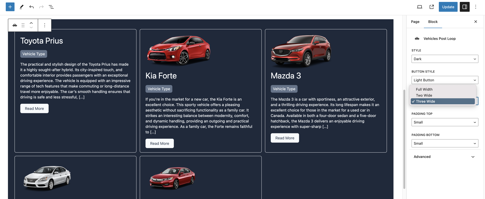
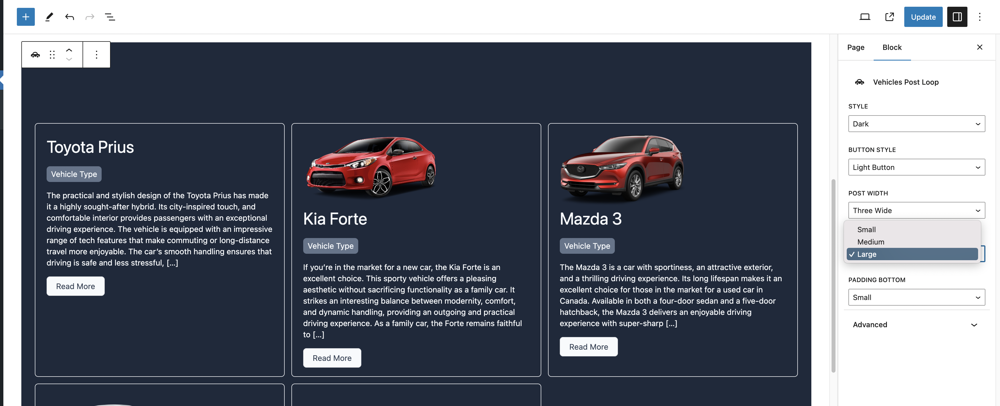

# Welcome to the Vehicles Post Loop Plugin! 🚗🔧

Hello and thank you for checking out our **Vehicles Post Loop Plugin** for WordPress! This plugin is designed to enhance your website by adding a custom post type 'Vehicles' and a taxonomy 'Vehicle Type'. 🚀

## What Does This Plugin Do? 🛠️

- **Custom Post Type**: Adds a new post type to your WordPress site named 'Vehicles'. This allows you to manage and display vehicles as a unique content type.
- **Custom Taxonomy**: Introduces a taxonomy called 'Vehicle Type', making it easier to categorize and filter vehicles.
- **Gutenberg Block - Vehicles Post Loop**: A powerful Gutenberg block that renders these vehicles on your site. Whether you're showcasing a car gallery, a bike store, or any vehicle-related content, our block makes it simple and elegant.

## Our Commitment to Quality 🌟

Our goal is to provide you with a responsive and high-performance interface that not only looks great but also adheres to AAA WCAG accessibility standards. We believe in creating an inclusive web experience for everyone. 🌍

Stay tuned as we guide you through the installation, usage, and all the fantastic features our plugin offers!

## Getting Started 🚀

Follow these steps to install and start using the Vehicles Post Loop Plugin on your WordPress site.

### Step 1: Install WordPress

Before you begin, make sure you have WordPress installed on your hosting environment. If you haven't installed WordPress yet, [follow the official WordPress installation guide](https://wordpress.org/support/article/how-to-install-wordpress/).

### Step 2: Install the Vehicles Post Loop Plugin

To install our plugin:

1. Download the latest version of the Vehicles Post Loop Plugin from the repository.
2. Compress the plugin repository into a ZIP file.
3. Go to your WordPress dashboard.
4. Navigate to **Plugins > Add New > Upload Plugin**.
5. Choose the ZIP file you created and click **Install Now**.
6. After the installation is complete, click **Activate Plugin**.

### Step 3: Add Vehicles Content

1. In your WordPress dashboard, go to the **Vehicles** section.
2. Add new vehicle entries, including title, excerpt or content, and an image. Assigning a category is optional but recommended for better organization.

### Step 4: Create a New Page with the Vehicles Post Loop Block

1. Go to **Pages > Add New** in your WordPress dashboard.
2. Use the Gutenberg editor to add a new block.
3. Search for and add the **'Vehicles Post Loop'** block.
4. Customize the block settings as per your requirements.

And that's it! You're now ready to showcase your vehicles using our responsive and accessible Vehicles Post Loop block.

## Commitment to Accessibility 🌐🤝

Our plugin is developed with a deep commitment to accessibility, ensuring that all Canadian citizens, including First Nations, persons with disabilities, and new Canadians, can seamlessly interact with your website. We understand the importance of creating an inclusive digital space that accommodates the varied needs of every user.

### Embracing POUR Principles

The Vehicles Post Loop Plugin is designed in strict adherence to the POUR principles, ensuring that your content is Perceivable, Operable, Understandable, and Robust:

#### Perceivable

- **Color Contrast**: We use high-contrast color schemes to ensure text and images are easily discernible for users with visual impairments.
- **Alt Tags for Images**: Every image within our plugin, including vehicle photos, comes with descriptive alt tags. This practice makes content accessible to screen reader users and those with visual impairments.

#### Operable

- **Keyboard Navigation (Tabbable Menus)**: All features of our plugin, including menus and the Vehicles Post Loop block, are fully navigable using keyboard controls. This functionality is crucial for users who cannot use a mouse or prefer keyboard navigation.
- **Consistent and Predictable**: Our interface maintains consistency, making it easier for users to predict and understand navigation patterns.

#### Understandable

- **Clear Language**: We use straightforward and clear language to ensure that our content is understandable for everyone, including those with cognitive disabilities and new Canadians who might still be learning the language.
- **Intuitive Design**: The plugin's design follows logical patterns for ease of use, reducing the learning curve for all users.

#### Robust

- **Cross-Browser Compatibility**: Our plugin is tested across various browsers and devices to ensure a consistent experience for every user, regardless of their technology.
- **Compliance with Latest Standards**: We regularly update our plugins to comply with the latest web standards and accessibility guidelines.

### Our Ongoing Commitment

We are dedicated to continuous improvement in accessibility. We welcome feedback and suggestions from users to help make our plugin even more inclusive. Our goal is to ensure that every Canadian, regardless of ability or background, can access and benefit from the content and services provided through our plugin.

## Instructions for Using the Vehicles Post Loop Block 🛠️

Easily customize the appearance and layout of the Vehicles Post Loop block with our intuitive settings. Below are the steps to configure the block to fit your site's design and content needs.

### Step 1: Choose Your Style

Our block comes with two distinct styles: 'Default' and 'Dark'. Select the one that best fits your site's theme.

- **Default Style**: A light and clean look suitable for most websites.
- **Dark Style**: Ideal for darker-themed websites or for creating a standout section.

### Step 2: Select Button Style

Customize the button's appearance within the block using the 'Button Style' dropdown. Choose a style that complements your site's design and enhances user experience.

### Step 3: Set Post Width

Decide how many posts you want to display per row. You can choose to have your posts span the full width of the screen or opt for a 2 or 3 column layout.

- **Full Screen**: Maximizes the use of space, ideal for showcasing large images or detailed content.
- **2 or 3 Columns**: Perfect for a more compact display or when you want to feature multiple posts in a row.

### Step 4: Adjust Padding

Fine-tune the top and bottom padding of your block to ensure it fits neatly within your page layout. Proper padding can significantly enhance the visual appeal and readability of your content.

By following these simple steps, you can effectively customize the Vehicles Post Loop block to meet your specific design and content requirements. If you have any questions or need further assistance, please feel free to reach out to our support team.

